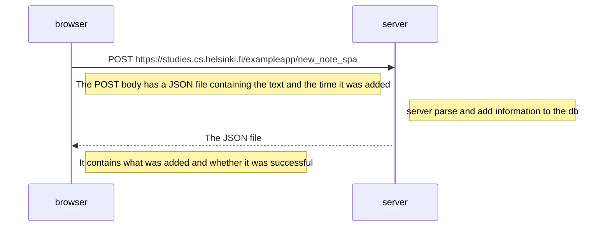

```mermaid
sequenceDiagram

    participant browser
    participant server

    browser->>server: POST https://studies.cs.helsinki.fi/exampleapp/new_note_spa
    Note right of browser: The POST body has a JSON file containing the text and the time it was added
    activate server
    Note right of server: server parse and add information to the db
    server-->>browser: The JSON file
    Note right of browser: It contains what was added and whether it was successful
```